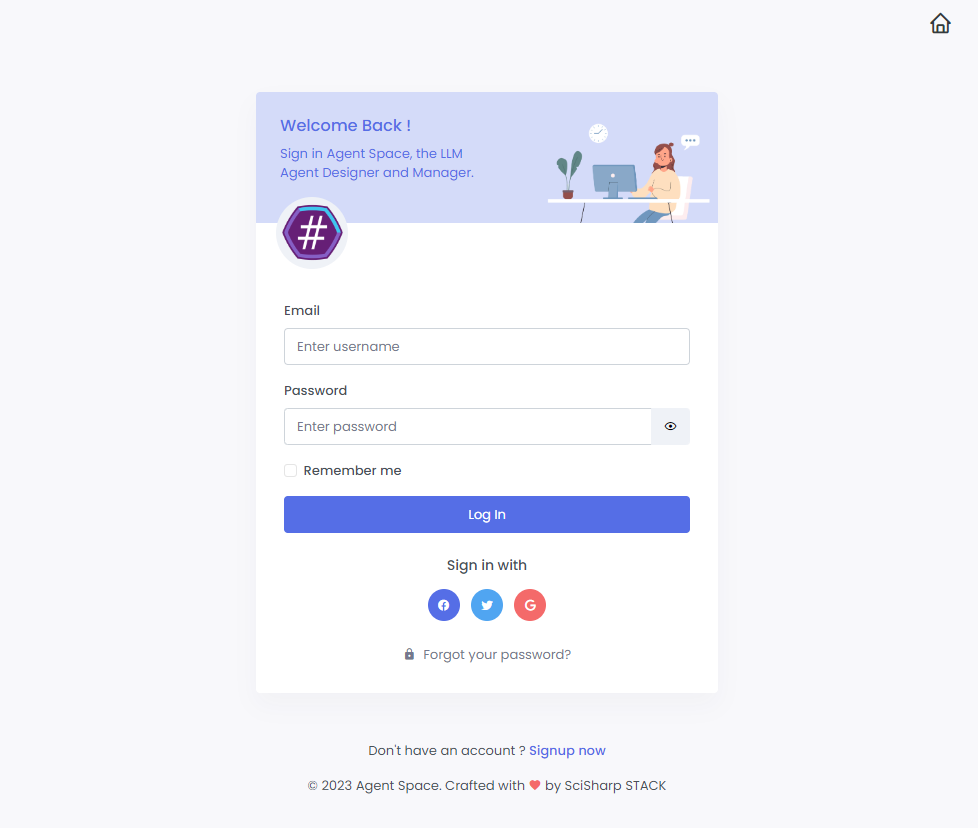

# Agent Space

> Build, Test and Manage your LLM multi-agents in one place

This online demo uses [Pizza Bot](https://botsharp.readthedocs.io/en/latest/quick-start/get-started.html#get-started-with-pizza-bot) provided by [BotSharp](https://github.com/SciSharp/BotSharp) as an example to show a complete use case of how to use Agent Space to build, test and manage AI Chatbot. You can start building your own enterprise LLM application based on this case.

The **Agent Space** project consists of a front-end UI and a back-end service. The front-end framework uses SvelteKit, and the back-end service uses the ASP.NET Core MVC framework. The LLM application framework uses BotSharp.

### Run UI project
```shell
git clone https://github.com/SciSharp/AgentSpace
cd SpaceUI
npm install
npm run dev
```

### Run API Service
```shell
cd SpaceService
dotnet run --project .\src\WebStarter\WebStarter.csproj -p SolutionName=SpaceService
```

After you have successfully run the UI and service projects, visit http://localhost:5000/ and you will see a login page.

